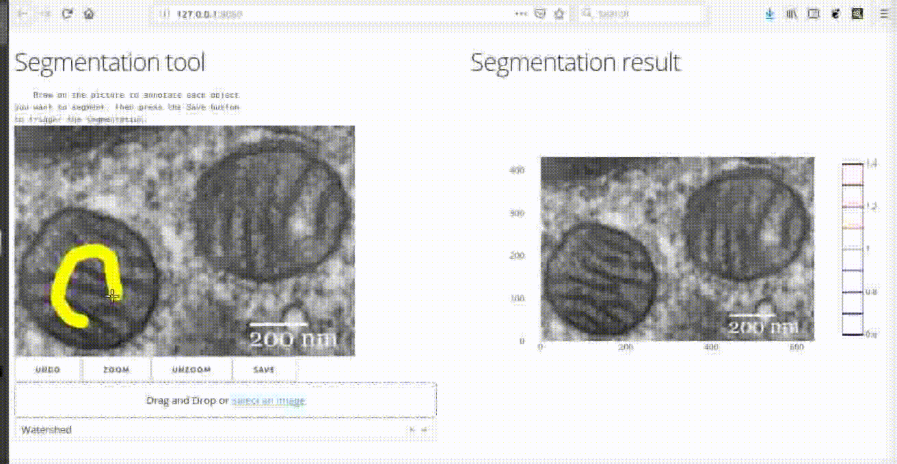

# dash-canvas

dash-canvas is a package for image processing with 
[Dash](https://dash.plot.ly/). It provides a Dash component for
annotating images, as well as utility functions for using such
annotations for various image processing tasks. 

Try out the 
[demo app for object segmentation](http://dash-canvas.herokuapp.com/app1) or the
[demo app for manual correction of segmentation](https://dash-canvas.herokuapp.com/app2).

Get started with:
1. Install `dash_canvas`: `pip install dash-canvas` (you will also need
   `dash-core-components` to run the apps).
2. Run `python app_seg.py` (for interactive segmentation) or 
   `python correct_segmentation.py` (for correcting a pre-existing
   segmentation)
3. Visit http://localhost:8050 in your web browser

